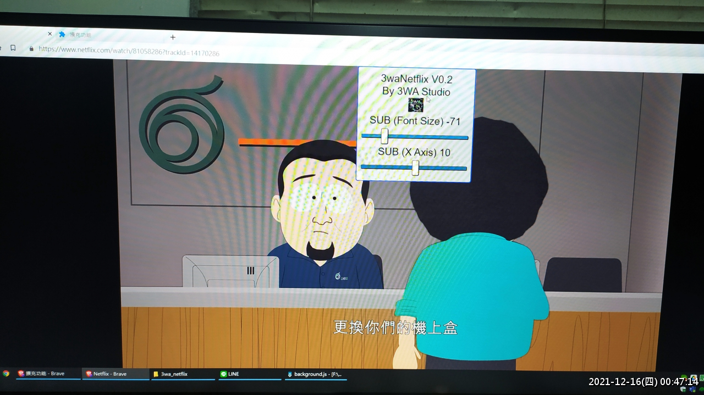
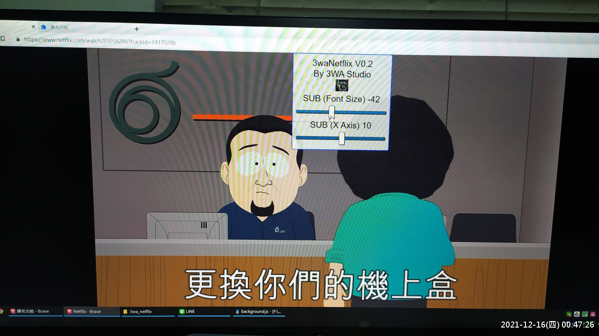
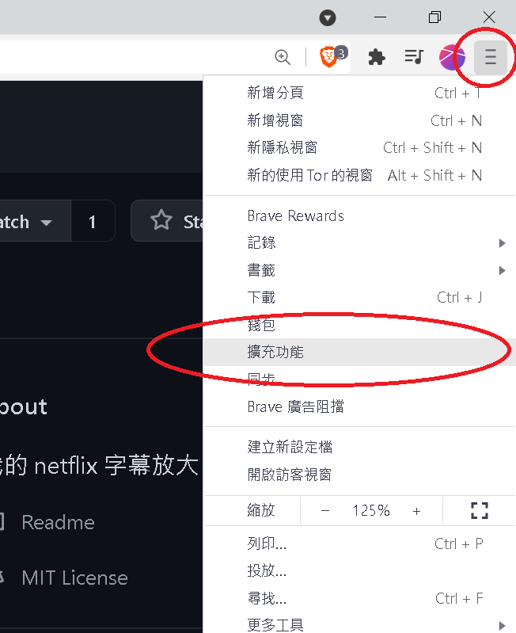
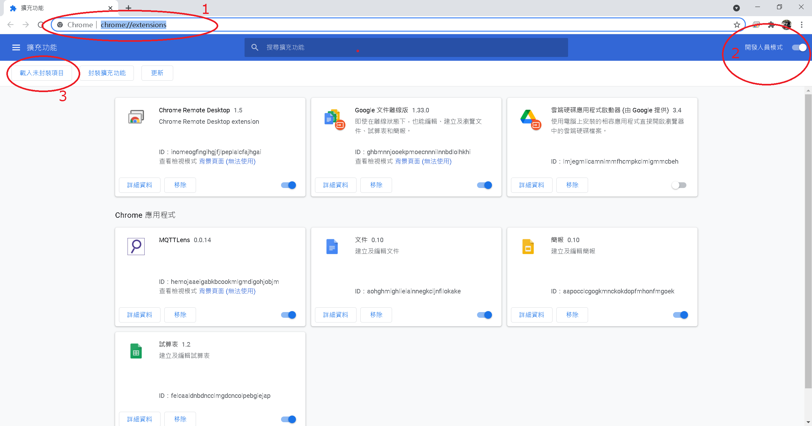
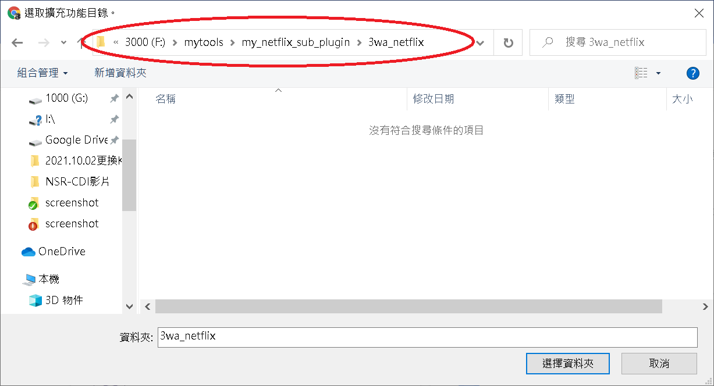
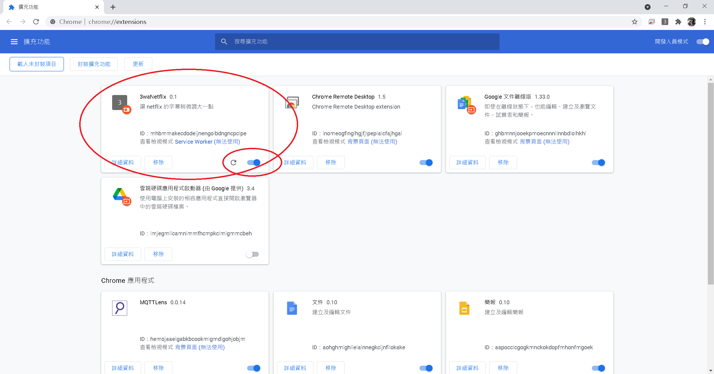
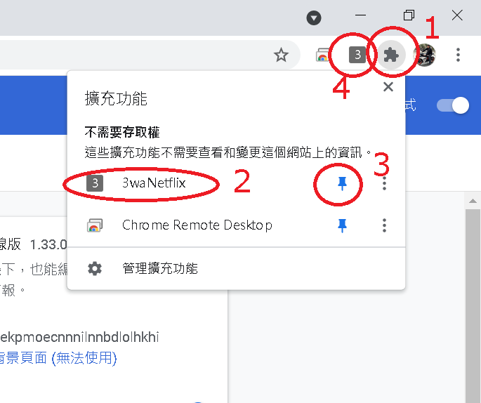
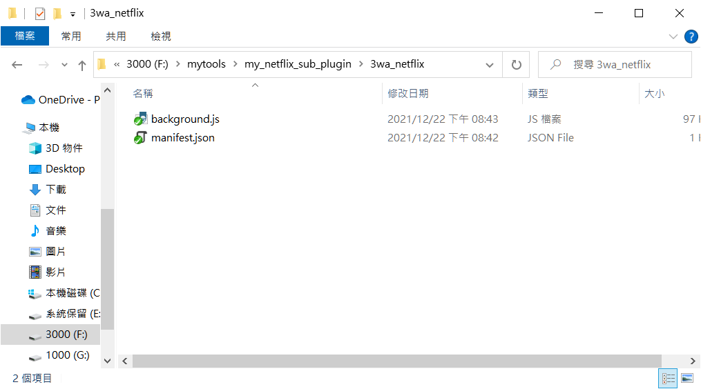
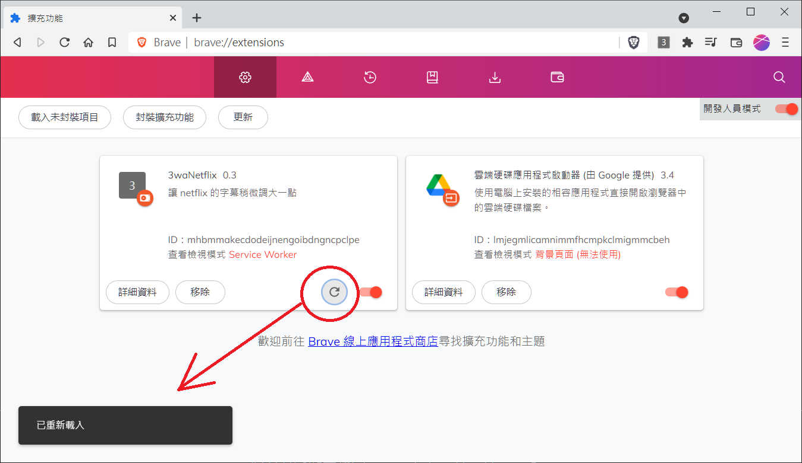

# my_netflix_sub_plugin
netflix 字幕放大 extension

<h2>功能：</h2>
有用 netflix 的朋友應該都會弄台電腦把 netflix 接到電視用大螢幕播，netflix 的字幕小到讓人很火大。 
網路上一堆瀏覽器 extension、包含官方的 https://www.netflix.com/SubtitlePreferences 設定後都無效...  
萬念俱灰下，只好自己練功... 
 
<h2>程式開發：</h2>
此程式是 chrome、brave、edge extension 擴充程式，使用 javascript 開發。 
netflix 的字幕通常藏在 html tag SVG image ，新的字幕載入，就等同載一個新的 image tag 
字幕 image 是圖片，所以要調整字幕變大，最簡單的方法就是加載 css 
讓字幕有新的影像寬度100%，新高度，如 120px、130px(依單、雙行字調整) 
並修正字幕的 x 軸起始位置，對程式寫法有興趣的朋友，可以詳見 3wa_netflix/background.js 
<s>我將整包 jquery3.6.0 載進來比較方便開發，pure js已很久沒寫沒那麼熟練...</s> 
然後就在head註冊新的css，並利用 setInterval 不斷的修正 image 起始位置 
註：0.5 版後，移除 jquery 3.6.0 ，重寫了一套精簡單版的 jquery 放在 background.js 裡 
邏輯很簡單，就這樣而已^^ 
 
 
<h2>程式開發：</h2>
作者：羽山秋人 (https://3wa.tw/)
 
 
<h2>License：</h2>
完全免費的 MIT License
 
 
<h2>最初更新時間：</h2>
2021-10-03
 
<h2>官方上架更新時間：</h2>
(2022-01-28) https://chrome.google.com/webstore/detail/3wanetflix/hpmbbonnlchnbbakdegcbbflbjgganaf/related
 
<h2>版本：</h2>
V1.2 (2022-04-28) 
V1.1 (2022-04-25) 
V1.0 (2022-04-25) 
V0.9 (2022-04-23)

  
<h2>相依套件：</h2>
無
  

執行前

 

執行後

 
 
<a target="_blank" href="https://github.com/shadowjohn/my_netflix_sub_plugin/blob/main/screenshot/2.mp4">使用方法影片</a>

<h2>使用方法：</h2>
0、使用官方 Chrome Store 安裝：https://chrome.google.com/webstore/detail/3wanetflix/hpmbbonnlchnbbakdegcbbflbjgganaf/related

或

1、(原始檔下載安裝方法)： 
(V1.2 Beta) https://github.com/shadowjohn/my_netflix_sub_plugin/raw/main/release/V1.2/3wa_netflix.zip 
(V1.1 穩定版) https://github.com/shadowjohn/my_netflix_sub_plugin/raw/main/release/V1.1/3wa_netflix.zip 

 
2、解壓縮zip檔
 
3、開啟瀏覽器，輸入：chrome://settings/
 

這張圖是 brave 瀏覽器的設定方式

4、開啟擴充功能，開發人員模式打開，選擇「載入未封裝項目」
 

5、選擇資料夾到剛才解壓縮檔案後的「3wa_netflix」目錄，按下「選擇資料夾」

要選到裡面目錄的「3wa_netflix」才是正確哦

要看到套件有匯入成功，且有啟動

 
6、在網址列右邊，按下擴充程式(1)，找到 3waNetflix (2)，把標簽點開(3)，就會出現方框的「3」在標籤列上。 
7、開啟 netflix ，隨意播一個影片，然後按一下「3」，等大概3秒後，字幕就會變大了 

8、如果字體大小、位置仍滿不意，可以將滑鼠移至畫面中上方，就會出現調整選單 
( 羽山自己家的設定 字體大小「1.5」 )

9、使用範例影片：<a target="_blank" href="https://github.com/shadowjohn/my_netflix_sub_plugin/blob/main/screenshot/2.mp4">https://github.com/shadowjohn/my_netflix_sub_plugin/blob/main/screenshot/2.mp4</a>
 

10、如果只是要更新的版本，可以把 manifest.json、background.js 覆蓋 
 

11、然後按一下「紅圈圈起」的地方，就可以重新載入模組 
回到 Netflix 建議按「F5」重新載入畫面，然後再按一次「3」啟動字體放大功能 
(註：V0.5 版後不用等3秒了，點了馬上使用)
 
 
<h2>開發方法說明：</h2>
Netflix 字幕加大心得分享：https://3wa.tw/blog/blog.php?id=1935
 
<h2>版本說明：</h2>
<pre>
  (2022-04-25) V1.2 版：
  1、網友 MAN哥 遇到字會重複變雙行的問題修正
  
    (2022-04-25) V1.1 版：
    1、dcard 的網址有 netflix 也會誤判成 netflix，要改成檢查完整的 netflix.com
    2、此版本同 V1.0 只是送簽到 Google Extension 商店的版本少了 dcard 修正，重新發一版
    
    (2022-04-25) V1.0 版：
    1、修正修改後紀錄的問題
    2、dcard 的網址有 netflix 也會誤判成 netflix，要改成檢查完整的 netflix.com
  
    (2022-04-23) V0.9 版：
    1、加入字體粗細可以調整
    2、加入字框粗細可以調整

    (2022-04-20) V0.8 版：
    1、加入字距可以調整
  
    (2022-03-22) V0.7 版：
    1、官方的中文字以前是圖片，現在改成文字了
    
    (2022-01-06) V0.6 版：
    1、移除不必要的 console.log
    
    (2021-12-26) V0.5 版：
    1、移除 jQuery 3.6.0
    2、點「3」後，不用等3秒了
    
    (2021-12-23) V0.4 版：
    1、改用比例放大字體 0.1~3.0
    
    (2021-12-22) V0.3 版：
    1、修正雙行字大小問題
    
    (2021-12-15) V0.2 版：
    1、放大後字幕置中問題修正
    2、字幕大小可再手動調整
    3、修正 3 一直被連點的問題
    4、更新核心成 jQuery 3.6.0
    
    (2021-10-03) V0.1 版：
    1、初版
  
</pre>
   
<h2>Todo：</h2>
<ul>
  <li>(Done 2021-12-15)  1、放大後字幕置中問題修正</li>
  <li>(Done 2021-12-15)  2、字幕大小可再手動調整</li>
  <li>(Done 2021-12-15)  3、修正 3 一直被連點的問題</li>
  <li>(Done 2021-12-22)  4、修正雙行字大小的問題</li>
  <li>(Done 2021-12-23)  5、改用比例放大</li>
  <li>(Done 2021-12-26)  6、移除 jQuery 3.6.0</li>
  <li>(Done 2021-12-26)  7、點「3」後，不用等3秒</li>
  <li>(Done 2022-04-20)  8、字距可以調整</li>
  <li>(Done 2022-04-23)  9、字體粗細可調</li>
  <li>(Done 2022-04-23) 10、字框粗細可調</li>
  <li>(Done 2022-04-25) 11、修改後紀錄的問題修正</li>
  <li>(Done 2022-04-25) 12、dcard 的網址有 netflix 也會誤判成 netflix，要改成檢查完整的 netflix.com</li>
  <li>(Done 2022-04-28) 13、1、網友 MAN哥 遇到字會重複變雙行的問題修正</li>  
</ul>
