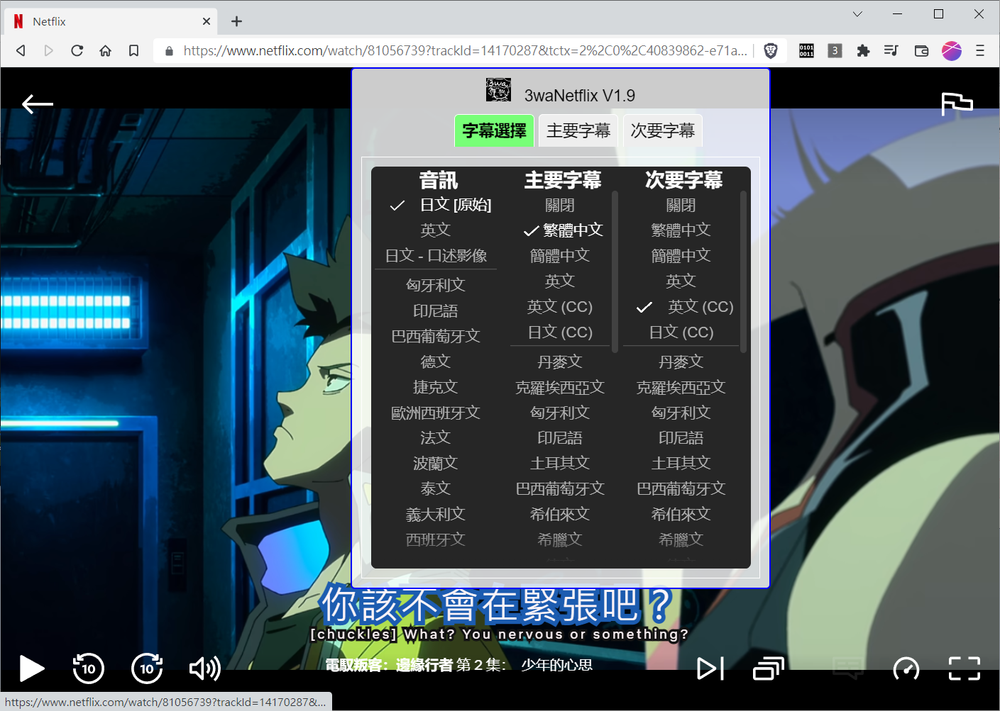

# my_netflix_sub_plugin
netflix 字幕放大、雙字幕顯示 extension

<h2>功能：</h2>
	有用 netflix 的朋友應該都會弄台電腦把 netflix 接到電視用大螢幕播，netflix 的字幕小到讓人很火大。 
網路上一堆瀏覽器 extension、包含官方的 https://www.netflix.com/SubtitlePreferences 設定後都無效...  
萬念俱灰下，只好自己練功... 
 
<h2>程式開發：</h2>
	此程式是 chrome、brave、edge extension 擴充程式，使用 javascript 開發。 
netflix 的字幕通常藏在 html tag SVG image ，新的字幕載入，就等同載一個新的 image tag 
字幕 image 是圖片，所以要調整字幕變大，最簡單的方法就是加載 css 
讓字幕有新的影像寬度100%，新高度，如 120px、130px(依單、雙行字調整) 
並修正字幕的 x 軸起始位置，對程式寫法有興趣的朋友，可以詳見 3wa_netflix/background.js 
<s>我將整包 jquery3.6.0 載進來比較方便開發，pure js已很久沒寫沒那麼熟練...</s> 
然後就在head註冊新的css，並利用 setInterval 不斷的修正 image 起始位置 
註：0.5 版後，移除 jquery 3.6.0 ，重寫了一套精簡單版的 jquery 放在 background.js 裡 
註：1.9 版後，重新加回 jquery 3.6.0 ，放棄了自己寫的精簡版 jquery ，自己重刻 jquery 覺得人生太難，事件太多了 XXXXD 
1.9 版的雙字幕，研究了許久，原本想破解下載字幕位置、嘗試找出 movie metadata 註冊 xhr、重新 hook JSON.parse 
但 chrome extension 在 manifest V3 以後，只能使用 service_worker，且 sandbox 化後限制很多，無法直接改寫前端 window 裡的東西 
考量 manifest V2 明年就會終止維護與上架，還是決定繼續使用 V3 開發 
目前找到一個暗黑作法，就是模擬使用者無腦手動點第一字幕、第二字幕，反覆一直點，取得字幕，再一併顯示 
如果有想到更好的作法再調整吧 
邏輯很簡單，就這樣而已^^ 
 
 
<h2>程式開發：</h2>
	作者：羽山秋人 (https://3wa.tw/)
 
 
<h2>License：</h2>
	完全免費的 MIT License
 
 
<h2>最初更新時間：</h2>
	2021-10-03
 
<h2>官方上架更新時間：</h2>
	(2022-01-28) https://chrome.google.com/webstore/detail/3wanetflix/hpmbbonnlchnbbakdegcbbflbjgganaf/related
 
<h2>版本：</h2>
	V2.0 (2022-09-27) 
	V1.9 (2022-09-24) 
	V1.8 (2022-07-11) 
	V1.7 (2022-06-11) 
	V1.6 (2022-05-18) 
	V1.5 (2022-05-12) 
	V1.4 (2022-05-11) 
	V1.3 (2022-05-01) 
	V1.2 (2022-04-28) 
	V1.1 (2022-04-25) 
	V1.0 (2022-04-25) 
	V0.9 (2022-04-23)

  
<h2>相依套件：</h2>
	jQuery 3.6.0 

  

執行前

 

執行後

 

執行後

 

執行後

 
<a target="_blank" href="https://github.com/shadowjohn/my_netflix_sub_plugin/blob/main/screenshot/2.mp4">使用方法影片</a>

<h2>使用方法：</h2>
1、使用官方 Chrome Store 安裝：https://chrome.google.com/webstore/detail/3wanetflix/hpmbbonnlchnbbakdegcbbflbjgganaf/related
從 Store 安裝直接跳步驟 9 直接看使用範例即可

或

(原始檔下載安裝方法)： 
(V2.0 雙字幕 Beta) https://github.com/shadowjohn/my_netflix_sub_plugin/raw/main/release/V2.0/3wa_netflix.zip  
(V1.9 雙字幕 Beta) https://github.com/shadowjohn/my_netflix_sub_plugin/raw/main/release/V1.9/3wa_netflix.zip  
(V1.8 穩定版) https://github.com/shadowjohn/my_netflix_sub_plugin/raw/main/release/V1.8/3wa_netflix.zip  
(歷代版本) https://github.com/shadowjohn/my_netflix_sub_plugin/raw/main/release/  

 
2、解壓縮zip檔
 
3、開啟瀏覽器，輸入：chrome://settings/
 

這張圖是 brave 瀏覽器的設定方式

4、開啟擴充功能，開發人員模式打開，選擇「載入未封裝項目」
 

5、選擇資料夾到剛才解壓縮檔案後的「3wa_netflix」目錄，按下「選擇資料夾」

要選到裡面目錄的「3wa_netflix」才是正確哦

要看到套件有匯入成功，且有啟動

 
6、在網址列右邊，按下擴充程式(1)，找到 3waNetflix (2)，把標簽點開(3)，就會出現方框的「3」在標籤列上。 
7、開啟 netflix ，隨意播一個影片，然後按一下「3」，等大概3秒後，字幕就會變大了 

8、如果字體大小、位置仍滿不意，可以將滑鼠移至畫面中上方，就會出現調整選單 
( 3waNetflix V2.0 版以後，將調整選單取代原本右下角的字幕按鈕 ) 
( 羽山自己家的設定 字體大小「1.5」 )

9、使用範例影片：
https://github.com/shadowjohn/my_netflix_sub_plugin/blob/main/screenshot/V1.9_4.mp4?raw=true
 

10、如果只是要更新的版本，可以把 manifest.json、background.js 覆蓋 
 

11、然後按一下「紅圈圈起」的地方，就可以重新載入模組 
回到 Netflix 建議按「F5」重新載入畫面，然後再按一次「3」啟動字體放大功能 
(註：V0.5 版後不用等3秒了，點了馬上使用)
 
 
<h2>開發方法說明：</h2>
Netflix 字幕加大心得分享：https://3wa.tw/blog/blog.php?id=1935
Netflix 雙字幕的心得分享：https://3wa.tw/blog/blog.php?id=1986
 
<h2>版本說明：</h2>
<pre>
  (2022-09-27) V2.0 版：
  1、使用注意事項獨立一個 tab 分頁
  2、圖片型字幕閃耀問題修正
  3、當畫面靜置一段時間，會發生無法回上頁、右上的問題反應也無法點選
  4、調整 UI 時，有時會失效
  5、無人說話時，字幕退場的時間不精準  
  6、如果使用者在調整時間軸，延長消失時間(6秒)
  7、全螢幕時，滑鼠沒移動一段時間後要自動隱藏(6秒)
  8、縮小設定畫面可以觸發顯示的範圍
  9、調整畫面很容易滑鼠移動就消失，將 mouseout 改成 mouseleave 後較為正常
  10、UI 控制區，只有滑鼠進入的高度 36% 切入才有效，不然螢幕太小時，調時間軸也會一直檔到
  11、UI 控制區，改成點右下角語言，並加入嘻花效果
  12、英文字幕，二行字會黏在一起
  13、UI 控制區畫面改緊緻，滑塊加大

  (2022-09-24) V1.9 版：
  1、加回 jQuery 3.6.0
  2、雙字幕功能
  3、第二字幕 UI 設定介面
  4、加入字型選擇
  5、使用者正在「準備切換下一集」或「選集數」 或 「調影片速度」，停用設定 UI
  6、UI 控制區，只有滑鼠進入的高度 70% 切入才有效，不然螢幕太小時，調時間軸也會一直檔到
  7、原 3wanetflix 的字幕要插在 video 裡，這樣全螢幕才有作用，現在發現要再 video 外層的 div 才行
  8、修正字幕不需要強制大寫：font-variant: small-caps
  9、主要字幕、次要字幕可各自設定樣式
  10、如果有下一集、工作人員名單、返回瀏覽、略過簡介，要可以點
  11、加入第二字幕高度
  12、已知問題：
	(1). 啟動 3waNetflix V1.9 版後，下方進度條會失蹤，需要用滑鼠滑過下排音量控制才會出現
	(2). 當滑鼠進入下排控制區時，字幕功能就會暫停，請往上移開
	(3). 已知有些改 1080p 或是部分字幕是「圖片型字幕」出字會異常，之後再研究
  

    (2022-07-11) V1.8 版：
    1、修正文字間距問題

    (2022-06-11) V1.7 版：
    1、當使用者使用1080p套件，仍為圖片型文字，調整字幕置中的問題
  
    (2022-05-18) V1.6 版：
    1、預設的字體顏色：#fff5f8，邊框顏色：#1c5cb0，字體粗細：1.4、字框粗細：10、字幕高度：12，字體大小：1.6、字體間距：12.5
    2、修正在選影片頁時，控制項不能被點選
    3、檢查 chrome 字體置中的問題，檢查正常
  
    (2022-05-12) V1.5 版：
    1、界面改回中間
  
    (2022-05-11) V1.4 版：
    <s>1、界面改到右上角</s>
    2、字框粗細 0~50
    3、取消文字陰影
    4、增加字體顏色
    5、增加字體邊框顏色
  
    (2022-05-01) V1.3 版：
    1、字幕高度可以調整
    2、界面功能只在 netflix.com/watch 才會顯示
  
    (2022-04-25) V1.2 版：
    1、網友 MAN哥 遇到字會重複變雙行的問題修正
  
    (2022-04-25) V1.1 版：
    1、dcard 的網址有 netflix 也會誤判成 netflix，要改成檢查完整的 netflix.com
    2、此版本同 V1.0 只是送簽到 Google Extension 商店的版本少了 dcard 修正，重新發一版
    
    (2022-04-25) V1.0 版：
    1、修正修改後紀錄的問題
    2、dcard 的網址有 netflix 也會誤判成 netflix，要改成檢查完整的 netflix.com
  
    (2022-04-23) V0.9 版：
    1、加入字體粗細可以調整
    2、加入字框粗細可以調整

    (2022-04-20) V0.8 版：
    1、加入字距可以調整
  
    (2022-03-22) V0.7 版：
    1、官方的中文字以前是圖片，現在改成文字了
    
    (2022-01-06) V0.6 版：
    1、移除不必要的 console.log
    
    (2021-12-26) V0.5 版：
    1、移除 jQuery 3.6.0
    2、點「3」後，不用等3秒了
    
    (2021-12-23) V0.4 版：
    1、改用比例放大字體 0.1~3.0
    
    (2021-12-22) V0.3 版：
    1、修正雙行字大小問題
    
    (2021-12-15) V0.2 版：
    1、放大後字幕置中問題修正
    2、字幕大小可再手動調整
    3、修正 3 一直被連點的問題
    4、更新核心成 jQuery 3.6.0
    
    (2021-10-03) V0.1 版：
    1、初版
  
</pre>
   
<h2>Todo：</h2>
<ul>
  <li>(Done 2021-12-15)  1、放大後字幕置中問題修正</li>
  <li>(Done 2021-12-15)  2、字幕大小可再手動調整</li>
  <li>(Done 2021-12-15)  3、修正 3 一直被連點的問題</li>
  <li>(Done 2021-12-22)  4、修正雙行字大小的問題</li>
  <li>(Done 2021-12-23)  5、改用比例放大</li>
  <li>(Done 2021-12-26)  6、移除 jQuery 3.6.0</li>
  <li>(Done 2021-12-26)  7、點「3」後，不用等3秒</li>
  <li>(Done 2022-04-20)  8、字距可以調整</li>
  <li>(Done 2022-04-23)  9、字體粗細可調</li>
  <li>(Done 2022-04-23) 10、字框粗細可調</li>
  <li>(Done 2022-04-25) 11、修改後紀錄的問題修正</li>
  <li>(Done 2022-04-25) 12、dcard 的網址有 netflix 也會誤判成 netflix，要改成檢查完整的 netflix.com</li>
  <li>(Done 2022-04-28) 13、網友 MAN哥 遇到字會重複變雙行的問題修正</li>
  <li>(Done 2022-05-01) 14、字幕高度可以調整</li>
  <li>(Done 2022-05-01) 15、界面功能只在 netflix.com/watch 才會顯示</li>
  <li><s>(Done 2022-05-11) 16、界面改到右上角</s></li>
  <li>(Done 2022-05-11) 17、字框粗細 0~50</li>
  <li>(Done 2022-05-11) 18、取消文字陰影</li>
  <li>(Done 2022-05-11) 19、增加字體顏色</li>
  <li>(Done 2022-05-11) 20、增加字體邊框顏色</li>
  <li>(Done 2022-05-18) 21、預設的字體顏色：#fff5f8，邊框顏色：#1c5cb0，字體粗細：1.4、字框粗細：10、字幕高度：12，字體大小：1.6、字體間距：12.5</li>
  <li>(Done 2022-05-18) 22、修正在選影片頁時，控制項不能被點選</li>
  <li>(Done 2022-05-18) 23、檢查 chrome 字體置中的問題</li>
  <li>(Done 2022-06-11) 24、當使用者使用1080p套件，仍為圖片型文字，調整字幕置中的問題</li>
  <li>(Done 2022-07-11) 25、修正文字間距問題</li>
  <li>(Done 2022-09-24)26、雙字幕功能</li>
  <li>(Done 2022-09-22)27、使用者正在「準備切換下一集」或「選集數」 或 「調影片速度」，停用設定 UI</li>
  <li>(Done 2022-09-22)28、第二字幕 UI 設定介面</li>
  <li>(Done 2022-09-23)29、加入字型選擇</li>
  <li>(Done 2022-09-24)30、UI 控制區，只有滑鼠進入的高度 70% 切入才有效，不然螢幕太小時，調時間軸也會一直檔到</li>
  <li>(Done 2022-09-22)31、原 3wanetflix 的字幕要插在 video 裡，這樣全螢幕才有作用，現在發現要再 video 外層的 div 才行</li>
  <li>(Done 2022-09-23)32、修正字幕不需要強制大寫：font-variant: small-caps</li>
  <li>(Done 2022-09-24)34、使用者正在「準備切換下一集」或「選集數」 或 「調影片速度」，停用設定 UI</li>
  <li>(Done 2022-09-24)35、主要字幕、次要字幕可各自設定樣式</li>
  <li>(Done 2022-09-24)36、如果有下一集、工作人員名單、返回瀏覽、略過簡介，要可以點</li>
  <li>(Done 2022-09-24)37、第二字幕高度可調</li>
  <li>(Done 2022-09-25)38、使用注意事項獨立一個 tab 分頁</li>
  <li>(Done 2022-09-27)39、圖片型字幕閃耀問題修正</li>
  <li>(Done 2022-09-25)40、當畫面靜置一段時間，會發生無法回上頁、右上的問題反應也無法點選</li>
  <li>(Done 2022-09-25)41、調整 UI 時，有時會失效</li>
  <li>(Done 2022-09-25)42、無人說話時，字幕退場的時間不精準</li>
  <li>43、滑鼠進入下方 Control 區，時間軸需要顯示，不用透過滑過聲音鈕</li>
  <li>(Done 2022-09-25)44、如果使用者在調整時間軸，延長消失時間(6秒)</li>
  <li>(Done 2022-09-25)45、全螢幕時，滑鼠沒移動一段時間後要自動隱藏(6秒)</li>
  <li>(Done 2022-09-25)46、縮小設定畫面可以觸發顯示的範圍</li>
  <li>(Done 2022-09-25)47、調整畫面很容易滑鼠移動就消失，將 mouseout 改成 mouseleave 後較為正常</li>
  <li>(Done 2022-09-25)48、UI 控制區，只有滑鼠進入的高度 36% 切入才有效，不然螢幕太小時，調時間軸也會一直檔到</li>
  <li>(Done 2022-09-25)49、UI 控制區，改成點右下角語言，並加入嘻花效果</li>
  <li>(Done 2022-09-25)50、英文字幕，二行字會黏在一起</li>
  <li>(Done 2022-09-25)51、UI 控制區畫面改緊緻，滑塊加大</li>
</ul>
